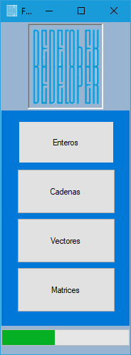
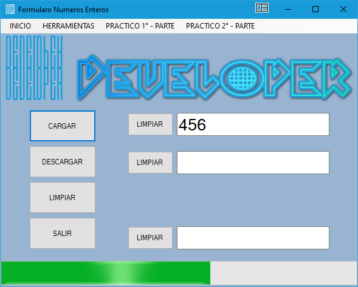

# U.A.G.R.M.-Programacion_I-Visual_Basic
Universidad: U.A.G.R.M. - Materia: Programacion I - Lenguaje: Visual Basic - IDE: Visual Estudio 2019 Community

***************************************************************************************************************
# Ide: Visual Studio Community 

----------------------------------------------------------------------------------------------------------------
# Imagen: Formulario Principal

---------------------------------------------------------------------------------------------------------------
# Class Numeros Enteros

# Inicio
Ejercicios:

1. 'CARGAR
2. 'DESCARAR
3. 'LIMPIAR
4. 'SALIR
----------------------------------------------------------------------------------------------------------------
# Herramientas

Ejercicios:

1. 'CONTAR DIGITOS
2. 'ENCONTRAR EL DIGITO MAYOR
3. 'ENCONTRAR EL DIGITO MENOR
4. 'CONTAR DIGITOS SUBMULTIPLOS DE M
5. 'CONTAR LAS VECES QUE M SE ENCUENTRA EN N 
6. 'BUSCAR SI EXISTE UN DIGITO EN UN NUMERO DE Class_Numero_Entero
7. 'VERIFICAR SI TODOS LOS DIGITOS SON IGUALES
8. 'FRECUENCIA DE UN DIGITO
9. 'VERIFICAR SI TODOS LOS DIGITOS SE REPITEN
10. 'INVERTIR UN NUMERO DE Class_Numero_Entero
11. 'VERIFICAR SI UN NUMERO DE Class_Numero_Entero ES CAPICUA
12. 'CONVERTIR UN NUMERO DE Class_Numero_Entero EN BINARIO
13. 'CONVERTIR UN DECIMAL A OTRA BASE(2..9)
14. 'FORMAR UN NUMERO DE Class_Numero_Entero CON DIGITOS PARES
15. 'FUSIONAR DOS NUMEROS DE Class_Numero_Entero
16. 'SEGMENTAR ORDENADAMENTE EN PARES E IMPARES
17. 'CORTAR UN DIGITO DE UN NUMERO DE Class_Numero_Entero
18. 'ORDENAR DIGITOS
19. 'INTERCALAR DIGITOS (MAYOR,MENOR,MAYOR,MENOR,...)
20. 'VERIFICAR SI UN NUMERO ES FIBONACCI
----------------------------------------------------------------------------------------------------------------
# Practico I - Parte

Ejercicios:

1. 'CONTAR DIGITOS CON FRECUENCIA PAR
2. 'CONTAR DIGITOS QUE PERTENCEN A LA SERIE FIBONACCI
3. 'VERIFICAR SI TODOS LOS DIGITOS SON PRIMOS
4. 'VERIFICAR SI LOS DIGITOS ESTAN EN ORDEN DESCENDENTE
5. 'ELIMINAR DIGITOS MULTIPLOS DE D
6. 'REORDENAR DIGITOS (PRIMOS AL PRINCIPIO, NO PRIMOS AL FINAL,...)
7. 'FORMAR UN NUMERO CON DIGITOS REPETIDOS
8. 'VERIFICAR SI TODOS LOS DIGITOS NO SE REPITEN
----------------------------------------------------------------------------------------------------------------
# Practico II - Parte

Ejercicios:

1. 'VERIFICAR SI LOS DIGITOS ESTAN EN RAZON DE DOS
2. 'ROTAR UN DIGITO
3. 'INTERCALAR (PRIMOS, NO PRIMOS,PRIMOS, NO PRIMOS,...)
4. 'ROTAR M DIGITOS
----------------------------------------------------------------------------------------------------------------
# Imagen: Formulario Numeros enteros

---------------------------------------------------------------------------------------------------------------
# Class Cadena

# Inicio:
1. Cargar
2. Descargar
3. Limpiar
4. Salir
---------------------------------------------------------------------------------------------------------------
# Herramientas:
* Obtener palabra "i"
* Posicion de la palabra "i"
* Obtener palabras mas extensa
* Obtener palabras mas cortas
* Eliminar caracter en la posicion
* invertir cadena
* Intercambiar palabra "i" con palabra "j"
* Eliminar palabras mas extensa
* Eliminar palabra mas corta
* Eliminar palabra "i"
---------------------------------------------------------------------------------------------------------------
# Practico:
1. Contar consonantes
2. Contar caracteres diferentes de una funcion
3. Verificar si una cadena tiene las 5 vocales, sean estas mayusculas o minusculas
4. Verificar si una cadena tiene mas vocales que consonandes
5. Eliminar los Caracteres repetidos y continuos
6. Contar palabras palindromas de una cadena
7. Eliminar una palabra "p" de una cadena
8. Ordenar palabras por numero caracteres diferentes de menor a MAYOR
9. Intercalar palabras de a su longitud mas extensa, luego mas corta, ...asi sucesivamente
10. invertir las palabras de una cadena
11. Eliminar palabra repetida y continuas
12. Contar palabras diferentes de una cadena. Se asume que existen palabras repetidas
---------------------------------------------------------------------------------------------------------------
# Imagen: Formulario Cadena
